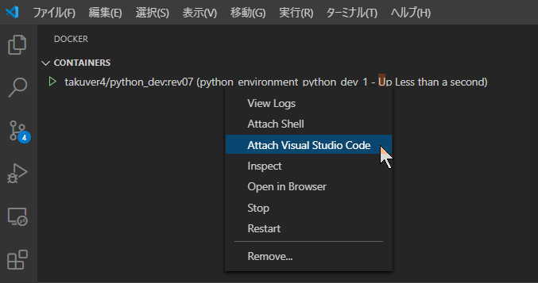

# Python Environment

## Overview

Build a python development environment.

## Requirements

* Docker for Windows
* Visual Studio Code
* X410 (X Window server for Windows 10)

## Build

```powershell
docker build -t takuver4/numpy_build:rev_mkl .
# docker build --no-cache -t takuver4/python_dev:rev08 .
```

## Push

```powershell
docker push takuver4/numpy_build:rev_mkl
```

```
docker run -it -P --name numpy_build_01 -v C:\Users\toruv\OneDrive\work\sample_code:/work/src -e DISPLAY=host.docker.internal:0.0 --rm takuver4/numpy_build:rev_mkl bash
```

## Create a container using `docker-compose up`

```powershell
docker-compose up -d
```

### (Option) Create a container using `docker run`

```powershell
$WORKING_DIR = "C:\Users\toruv\OneDrive\work\sample_code";
$DATA_DIR = "D:\abuse";
$PYTHON_LIB_DIR_ON_LINUX = "/usr/local/lib/python3.8/site-packages:/work/src/ty_lib";
docker run -it -d -P --name numpy_build_01 `
-v ${WORKING_DIR}:/work/src -v ${DATA_DIR}:/work/overuse `
-e DISPLAY=host.docker.internal:0.0 `
-e PYTHONPATH=$PYTHON_LIB_DIR_ON_LINUX --rm takuver4/numpy_build:rev_mkl
```

## Attach Visual Studio Code



## Information

### pip list

```txt
Package                       Version
----------------------------- ---------
alabaster                     0.7.12
anyio                         2.2.0
argon2-cffi                   20.1.0
async-generator               1.10
attrs                         20.3.0
Babel                         2.9.0
backcall                      0.2.0
bleach                        3.3.0
certifi                       2020.12.5
cffi                          1.14.5
chardet                       4.0.0
colour-science                0.3.16
cycler                        0.10.0
decorator                     5.0.7
defusedxml                    0.7.1
deprecation                   2.1.0
docutils                      0.16
entrypoints                   0.3
flake8                        3.9.1
idna                          2.10
imageio                       2.9.0
imagesize                     1.2.0
iniconfig                     1.1.1
ipykernel                     5.5.3
ipython                       7.22.0
ipython-genutils              0.2.0
ipywidgets                    7.6.3
jedi                          0.18.0
Jinja2                        2.11.3
json5                         0.9.5
jsonschema                    3.2.0
jupyter                       1.0.0
jupyter-client                6.1.12
jupyter-console               6.4.0
jupyter-core                  4.7.1
jupyter-packaging             0.9.1
jupyter-server                1.6.2
jupyterlab                    3.0.14
jupyterlab-pygments           0.1.2
jupyterlab-server             2.4.0
jupyterlab-widgets            1.0.0
kiwisolver                    1.3.1
MarkupSafe                    1.1.1
matplotlib                    3.4.1
mccabe                        0.6.1
mistune                       0.8.4
mpmath                        1.2.1
nbclassic                     0.2.7
nbclient                      0.5.3
nbconvert                     6.0.7
nbformat                      5.1.3
nest-asyncio                  1.5.1
notebook                      6.3.0
numpy                         1.20.2
opencv-python                 4.5.1.48
packaging                     20.9
pandocfilters                 1.4.3
parso                         0.8.2
pexpect                       4.8.0
pickleshare                   0.7.5
Pillow                        8.2.0
pip                           21.0.1
pkg-resources                 0.0.0
pluggy                        0.13.1
prometheus-client             0.10.1
prompt-toolkit                3.0.18
ptyprocess                    0.7.0
py                            1.10.0
pycodestyle                   2.7.0
pycparser                     2.20
pyflakes                      2.3.1
Pygments                      2.8.1
pyparsing                     2.4.7
pyrsistent                    0.17.3
PySide2                       5.15.2
PySimpleGUI                   4.39.1
pytest                        6.2.3
python-dateutil               2.8.1
pytz                          2021.1
pyzmq                         22.0.3
qtconsole                     5.0.3
QtPy                          1.9.0
requests                      2.25.1
scipy                         1.6.2
Send2Trash                    1.5.0
setuptools                    56.0.0
shiboken2                     5.15.2
six                           1.15.0
sniffio                       1.2.0
snowballstemmer               2.1.0
Sphinx                        3.5.4
sphinx-rtd-theme              0.5.2
sphinxcontrib-applehelp       1.0.2
sphinxcontrib-devhelp         1.0.2
sphinxcontrib-htmlhelp        1.0.3
sphinxcontrib-jsmath          1.0.1
sphinxcontrib-qthelp          1.0.3
sphinxcontrib-serializinghtml 1.1.4
sympy                         1.8
terminado                     0.9.4
testpath                      0.4.4
toml                          0.10.2
tomlkit                       0.7.0
tornado                       6.1
traitlets                     5.0.5
urllib3                       1.26.4
wavio                         0.0.4
wcwidth                       0.2.5
webencodings                  0.5.1
wheel                         0.36.2
widgetsnbextension            3.5.1
```

### apt list --installed

```
adduser/focal,now 3.118ubuntu2 all [installed]
apt/focal-updates,now 2.0.5 amd64 [installed]
autoconf/focal,now 2.69-11.1 all [installed,automatic]
automake/focal,now 1:1.16.1-4ubuntu6 all [installed,automatic]
autotools-dev/focal,now 20180224.1 all [installed,automatic]
base-files/focal-updates,now 11ubuntu5.3 amd64 [installed]
base-passwd/focal,now 3.5.47 amd64 [installed]
bash/focal-updates,now 5.0-6ubuntu1.1 amd64 [installed]
binutils-common/focal-updates,focal-security,now 2.34-6ubuntu1.1 amd64 [installed,automatic]
binutils-x86-64-linux-gnu/focal-updates,focal-security,now 2.34-6ubuntu1.1 amd64 [installed,automatic]
binutils/focal-updates,focal-security,now 2.34-6ubuntu1.1 amd64 [installed,automatic]
blt/focal,now 2.5.3+dfsg-4 amd64 [installed,automatic]
bsdutils/focal-updates,now 1:2.34-0.1ubuntu9.1 amd64 [installed]
build-essential/focal-updates,now 12.8ubuntu1.1 amd64 [installed]
bzip2/focal,now 1.0.8-2 amd64 [installed]
ca-certificates/focal-updates,focal-security,now 20210119~20.04.1 all [installed,automatic]
cargo/focal-updates,focal-security,now 0.47.0-1~exp1ubuntu1~20.04.1 amd64 [installed]
cbindgen/focal,now 0.12.1-1build1 amd64 [installed]
cmake-data/focal,now 3.16.3-1ubuntu1 all [installed,automatic]
cmake/focal,now 3.16.3-1ubuntu1 amd64 [installed]
coreutils/focal,now 8.30-3ubuntu2 amd64 [installed]
cpp-8/focal,now 8.4.0-3ubuntu2 amd64 [installed,automatic]
cpp-9/focal-updates,focal-security,now 9.3.0-17ubuntu1~20.04 amd64 [installed,automatic]
cpp/focal,now 4:9.3.0-1ubuntu2 amd64 [installed,automatic]
curl/focal-updates,focal-security,now 7.68.0-1ubuntu2.5 amd64 [installed]
dash/focal,now 0.5.10.2-6 amd64 [installed]
dbus/focal-updates,focal-security,now 1.12.16-2ubuntu2.1 amd64 [installed,automatic]
debconf/focal,now 1.5.73 all [installed]
debianutils/focal,now 4.9.1 amd64 [installed]
diffutils/focal,now 1:3.7-3 amd64 [installed]
distro-info-data/focal-updates,focal-security,now 0.43ubuntu1.4 all [installed,automatic]
dmsetup/focal,now 2:1.02.167-1ubuntu1 amd64 [installed,automatic]
dpkg-dev/focal,now 1.19.7ubuntu3 all [installed,automatic]
dpkg/focal,now 1.19.7ubuntu3 amd64 [installed]
e2fsprogs/focal,now 1.45.5-2ubuntu1 amd64 [installed]
fdisk/focal-updates,now 2.34-0.1ubuntu9.1 amd64 [installed]
ffmpeg/focal-updates,focal-security,now 7:4.2.4-1ubuntu0.1 amd64 [installed]
file/focal,now 1:5.38-4 amd64 [installed,automatic]
findutils/focal,now 4.7.0-1ubuntu1 amd64 [installed]
fontconfig-config/focal,now 2.13.1-2ubuntu3 all [installed,automatic]
fontconfig/focal,now 2.13.1-2ubuntu3 amd64 [installed,automatic]
fonts-dejavu-core/focal,now 2.37-1 all [installed,automatic]
fonts-droid-fallback/focal,now 1:6.0.1r16-1.1 all [installed,automatic]
fonts-noto-mono/focal-updates,now 20200323-1build1~ubuntu20.04.1 all [installed,automatic]
fonts-urw-base35/focal,now 20170801.1-3 all [installed,automatic]
freeglut3-dev/focal,now 2.8.1-3 amd64 [installed]
freeglut3/focal,now 2.8.1-3 amd64 [installed,automatic]
g++-9/focal-updates,focal-security,now 9.3.0-17ubuntu1~20.04 amd64 [installed,automatic]
g++/focal,now 4:9.3.0-1ubuntu2 amd64 [installed,automatic]
gcc-10-base/focal-updates,focal-security,now 10.2.0-5ubuntu1~20.04 amd64 [installed]
gcc-8-base/focal,now 8.4.0-3ubuntu2 amd64 [installed,automatic]
gcc-8/focal,now 8.4.0-3ubuntu2 amd64 [installed,automatic]
gcc-9-base/focal-updates,focal-security,now 9.3.0-17ubuntu1~20.04 amd64 [installed,automatic]
gcc-9/focal-updates,focal-security,now 9.3.0-17ubuntu1~20.04 amd64 [installed,automatic]
gcc/focal,now 4:9.3.0-1ubuntu2 amd64 [installed,automatic]
gfortran-8/focal,now 8.4.0-3ubuntu2 amd64 [installed,automatic]
ghostscript/focal-updates,focal-security,now 9.50~dfsg-5ubuntu4.2 amd64 [installed,automatic]
gir1.2-glib-2.0/focal-updates,now 1.64.1-1~ubuntu20.04.1 amd64 [installed,automatic]
git-man/focal-updates,focal-security,now 1:2.25.1-1ubuntu3.1 all [installed,automatic]
git/focal-updates,focal-security,now 1:2.25.1-1ubuntu3.1 amd64 [installed]
gpac-modules-base/focal,now 0.5.2-426-gc5ad4e4+dfsg5-5 amd64 [installed,automatic]
gpac/focal,now 0.5.2-426-gc5ad4e4+dfsg5-5 amd64 [installed]
gpgv/focal-updates,now 2.2.19-3ubuntu2.1 amd64 [installed]
grep/focal,now 3.4-1 amd64 [installed]
gsfonts/focal,now 1:8.11+urwcyr1.0.7~pre44-4.4 all [installed,automatic]
gzip/focal,now 1.10-0ubuntu4 amd64 [installed]
hicolor-icon-theme/focal,now 0.17-2 all [installed,automatic]
hostname/focal,now 3.23 amd64 [installed]
ibverbs-providers/focal,now 28.0-1ubuntu1 amd64 [installed,automatic]
icu-devtools/focal,now 66.1-2ubuntu2 amd64 [installed,automatic]
imagemagick-6-common/focal-updates,focal-security,now 8:6.9.10.23+dfsg-2.1ubuntu11.2 all [installed,automatic] 
imagemagick-6.q16/focal-updates,focal-security,now 8:6.9.10.23+dfsg-2.1ubuntu11.2 amd64 [installed,automatic]  
imagemagick/focal-updates,focal-security,now 8:6.9.10.23+dfsg-2.1ubuntu11.2 amd64 [installed]
init-system-helpers/focal,now 1.57 all [installed]
krb5-locales/focal-updates,focal-security,now 1.17-6ubuntu4.1 all [installed,automatic]
liba52-0.7.4/focal,now 0.7.4-20 amd64 [installed,automatic]
libacl1/focal,now 2.2.53-6 amd64 [installed]
libaom0/focal,now 1.0.0.errata1-3build1 amd64 [installed,automatic]
libapparmor1/focal-updates,now 2.13.3-7ubuntu5.1 amd64 [installed,automatic]
libapt-pkg6.0/focal-updates,now 2.0.5 amd64 [installed]
libarchive13/focal,now 3.4.0-2ubuntu1 amd64 [installed,automatic]
libargon2-1/focal,now 0~20171227-0.2 amd64 [installed,automatic]
libasan5/focal-updates,focal-security,now 9.3.0-17ubuntu1~20.04 amd64 [installed,automatic]
libasn1-8-heimdal/focal,now 7.7.0+dfsg-1ubuntu1 amd64 [installed,automatic]
libasound2-data/focal-updates,now 1.2.2-2.1ubuntu2.3 all [installed,automatic]
libasound2/focal-updates,now 1.2.2-2.1ubuntu2.3 amd64 [installed,automatic]
libass9/focal,now 1:0.14.0-2 amd64 [installed,automatic]
libasyncns0/focal,now 0.8-6 amd64 [installed,automatic]
libatomic1/focal-updates,focal-security,now 10.2.0-5ubuntu1~20.04 amd64 [installed,automatic]
libattr1/focal,now 1:2.4.48-5 amd64 [installed]
libaudit-common/focal,now 1:2.8.5-2ubuntu6 all [installed]
libaudit1/focal,now 1:2.8.5-2ubuntu6 amd64 [installed]
libavahi-client3/focal,now 0.7-4ubuntu7 amd64 [installed,automatic]
libavahi-common-data/focal,now 0.7-4ubuntu7 amd64 [installed,automatic]
libavahi-common3/focal,now 0.7-4ubuntu7 amd64 [installed,automatic]
libavc1394-0/focal,now 0.5.4-5 amd64 [installed,automatic]
libavcodec58/focal-updates,focal-security,now 7:4.2.4-1ubuntu0.1 amd64 [installed,automatic]
libavdevice58/focal-updates,focal-security,now 7:4.2.4-1ubuntu0.1 amd64 [installed,automatic]
libavfilter7/focal-updates,focal-security,now 7:4.2.4-1ubuntu0.1 amd64 [installed,automatic]
libavformat58/focal-updates,focal-security,now 7:4.2.4-1ubuntu0.1 amd64 [installed,automatic]
libavresample4/focal-updates,focal-security,now 7:4.2.4-1ubuntu0.1 amd64 [installed,automatic]
libavutil56/focal-updates,focal-security,now 7:4.2.4-1ubuntu0.1 amd64 [installed,automatic]
libbinutils/focal-updates,focal-security,now 2.34-6ubuntu1.1 amd64 [installed,automatic]
libblkid1/focal-updates,now 2.34-0.1ubuntu9.1 amd64 [installed]
libbluray2/focal,now 1:1.2.0-1 amd64 [installed,automatic]
libboost-all-dev/focal,now 1.71.0.0ubuntu2 amd64 [installed]
libboost-atomic-dev/focal,now 1.71.0.0ubuntu2 amd64 [installed,automatic]
libboost-atomic1.71-dev/focal,now 1.71.0-6ubuntu6 amd64 [installed,automatic]
libboost-atomic1.71.0/focal,now 1.71.0-6ubuntu6 amd64 [installed,automatic]
libboost-chrono-dev/focal,now 1.71.0.0ubuntu2 amd64 [installed,automatic]
libboost-chrono1.71-dev/focal,now 1.71.0-6ubuntu6 amd64 [installed,automatic]
libboost-chrono1.71.0/focal,now 1.71.0-6ubuntu6 amd64 [installed,automatic]
libboost-container-dev/focal,now 1.71.0.0ubuntu2 amd64 [installed,automatic]
libboost-container1.71-dev/focal,now 1.71.0-6ubuntu6 amd64 [installed,automatic]
libboost-container1.71.0/focal,now 1.71.0-6ubuntu6 amd64 [installed,automatic]
libboost-context-dev/focal,now 1.71.0.0ubuntu2 amd64 [installed,automatic]
libboost-context1.71-dev/focal,now 1.71.0-6ubuntu6 amd64 [installed,automatic]
libboost-context1.71.0/focal,now 1.71.0-6ubuntu6 amd64 [installed,automatic]
libboost-coroutine-dev/focal,now 1.71.0.0ubuntu2 amd64 [installed,automatic]
libboost-coroutine1.71-dev/focal,now 1.71.0-6ubuntu6 amd64 [installed,automatic]
libboost-coroutine1.71.0/focal,now 1.71.0-6ubuntu6 amd64 [installed,automatic]
libboost-date-time-dev/focal,now 1.71.0.0ubuntu2 amd64 [installed,automatic]
libboost-date-time1.71-dev/focal,now 1.71.0-6ubuntu6 amd64 [installed,automatic]
libboost-date-time1.71.0/focal,now 1.71.0-6ubuntu6 amd64 [installed,automatic]
libboost-dev/focal,now 1.71.0.0ubuntu2 amd64 [installed,automatic]
libboost-exception-dev/focal,now 1.71.0.0ubuntu2 amd64 [installed,automatic]
libboost-exception1.71-dev/focal,now 1.71.0-6ubuntu6 amd64 [installed,automatic]
libboost-fiber-dev/focal,now 1.71.0.0ubuntu2 amd64 [installed,automatic]
libboost-fiber1.71-dev/focal,now 1.71.0-6ubuntu6 amd64 [installed,automatic]
libboost-fiber1.71.0/focal,now 1.71.0-6ubuntu6 amd64 [installed,automatic]
libboost-filesystem-dev/focal,now 1.71.0.0ubuntu2 amd64 [installed,automatic]
libboost-filesystem1.71-dev/focal,now 1.71.0-6ubuntu6 amd64 [installed,automatic]
libboost-filesystem1.71.0/focal,now 1.71.0-6ubuntu6 amd64 [installed,automatic]
libboost-graph-dev/focal,now 1.71.0.0ubuntu2 amd64 [installed,automatic]
libboost-graph-parallel-dev/focal,now 1.71.0.0ubuntu2 amd64 [installed,automatic]
libboost-graph-parallel1.71-dev/focal,now 1.71.0-6ubuntu6 amd64 [installed,automatic]
libboost-graph-parallel1.71.0/focal,now 1.71.0-6ubuntu6 amd64 [installed,automatic]
libboost-graph1.71-dev/focal,now 1.71.0-6ubuntu6 amd64 [installed,automatic]
libboost-graph1.71.0/focal,now 1.71.0-6ubuntu6 amd64 [installed,automatic]
libboost-iostreams-dev/focal,now 1.71.0.0ubuntu2 amd64 [installed,automatic]
libboost-iostreams1.71-dev/focal,now 1.71.0-6ubuntu6 amd64 [installed,automatic]
libboost-iostreams1.71.0/focal,now 1.71.0-6ubuntu6 amd64 [installed,automatic]
libboost-locale-dev/focal,now 1.71.0.0ubuntu2 amd64 [installed,automatic]
libboost-locale1.71-dev/focal,now 1.71.0-6ubuntu6 amd64 [installed,automatic]
libboost-locale1.71.0/focal,now 1.71.0-6ubuntu6 amd64 [installed,automatic]
libboost-log-dev/focal,now 1.71.0.0ubuntu2 amd64 [installed,automatic]
libboost-log1.71-dev/focal,now 1.71.0-6ubuntu6 amd64 [installed,automatic]
libboost-log1.71.0/focal,now 1.71.0-6ubuntu6 amd64 [installed,automatic]
libboost-math-dev/focal,now 1.71.0.0ubuntu2 amd64 [installed,automatic]
libboost-math1.71-dev/focal,now 1.71.0-6ubuntu6 amd64 [installed,automatic]
libboost-math1.71.0/focal,now 1.71.0-6ubuntu6 amd64 [installed,automatic]
libboost-mpi-dev/focal,now 1.71.0.0ubuntu2 amd64 [installed,automatic]
libboost-mpi-python-dev/focal,now 1.71.0.0ubuntu2 amd64 [installed,automatic]
libboost-mpi-python1.71-dev/focal,now 1.71.0-6ubuntu6 amd64 [installed,automatic]
libboost-mpi-python1.71.0/focal,now 1.71.0-6ubuntu6 amd64 [installed,automatic]
libboost-mpi1.71-dev/focal,now 1.71.0-6ubuntu6 amd64 [installed,automatic]
libboost-mpi1.71.0/focal,now 1.71.0-6ubuntu6 amd64 [installed,automatic]
libboost-numpy-dev/focal,now 1.71.0.0ubuntu2 amd64 [installed,automatic]
libboost-numpy1.71-dev/focal,now 1.71.0-6ubuntu6 amd64 [installed,automatic]
libboost-numpy1.71.0/focal,now 1.71.0-6ubuntu6 amd64 [installed,automatic]
libboost-program-options-dev/focal,now 1.71.0.0ubuntu2 amd64 [installed,automatic]
libboost-program-options1.71-dev/focal,now 1.71.0-6ubuntu6 amd64 [installed,automatic]
libboost-program-options1.71.0/focal,now 1.71.0-6ubuntu6 amd64 [installed,automatic]
libboost-python-dev/focal,now 1.71.0.0ubuntu2 amd64 [installed,automatic]
libboost-python1.71-dev/focal,now 1.71.0-6ubuntu6 amd64 [installed,automatic]
libboost-python1.71.0/focal,now 1.71.0-6ubuntu6 amd64 [installed,automatic]
libboost-random-dev/focal,now 1.71.0.0ubuntu2 amd64 [installed,automatic]
libboost-random1.71-dev/focal,now 1.71.0-6ubuntu6 amd64 [installed,automatic]
libboost-random1.71.0/focal,now 1.71.0-6ubuntu6 amd64 [installed,automatic]
libboost-regex-dev/focal,now 1.71.0.0ubuntu2 amd64 [installed,automatic]
libboost-regex1.71-dev/focal,now 1.71.0-6ubuntu6 amd64 [installed,automatic]
libboost-regex1.71.0/focal,now 1.71.0-6ubuntu6 amd64 [installed,automatic]
libboost-serialization-dev/focal,now 1.71.0.0ubuntu2 amd64 [installed,automatic]
libboost-serialization1.71-dev/focal,now 1.71.0-6ubuntu6 amd64 [installed,automatic]
libboost-serialization1.71.0/focal,now 1.71.0-6ubuntu6 amd64 [installed,automatic]
libboost-stacktrace-dev/focal,now 1.71.0.0ubuntu2 amd64 [installed,automatic]
libboost-stacktrace1.71-dev/focal,now 1.71.0-6ubuntu6 amd64 [installed,automatic]
libboost-stacktrace1.71.0/focal,now 1.71.0-6ubuntu6 amd64 [installed,automatic]
libboost-system-dev/focal,now 1.71.0.0ubuntu2 amd64 [installed,automatic]
libboost-system1.71-dev/focal,now 1.71.0-6ubuntu6 amd64 [installed,automatic]
libboost-system1.71.0/focal,now 1.71.0-6ubuntu6 amd64 [installed,automatic]
libboost-test-dev/focal,now 1.71.0.0ubuntu2 amd64 [installed,automatic]
libboost-test1.71-dev/focal,now 1.71.0-6ubuntu6 amd64 [installed,automatic]
libboost-test1.71.0/focal,now 1.71.0-6ubuntu6 amd64 [installed,automatic]
libboost-thread-dev/focal,now 1.71.0.0ubuntu2 amd64 [installed,automatic]
libboost-thread1.71-dev/focal,now 1.71.0-6ubuntu6 amd64 [installed,automatic]
libboost-thread1.71.0/focal,now 1.71.0-6ubuntu6 amd64 [installed,automatic]
libboost-timer-dev/focal,now 1.71.0.0ubuntu2 amd64 [installed,automatic]
libboost-timer1.71-dev/focal,now 1.71.0-6ubuntu6 amd64 [installed,automatic]
libboost-timer1.71.0/focal,now 1.71.0-6ubuntu6 amd64 [installed,automatic]
libboost-tools-dev/focal,now 1.71.0.0ubuntu2 amd64 [installed,automatic]
libboost-type-erasure-dev/focal,now 1.71.0.0ubuntu2 amd64 [installed,automatic]
libboost-type-erasure1.71-dev/focal,now 1.71.0-6ubuntu6 amd64 [installed,automatic]
libboost-type-erasure1.71.0/focal,now 1.71.0-6ubuntu6 amd64 [installed,automatic]
libboost-wave-dev/focal,now 1.71.0.0ubuntu2 amd64 [installed,automatic]
libboost-wave1.71-dev/focal,now 1.71.0-6ubuntu6 amd64 [installed,automatic]
libboost-wave1.71.0/focal,now 1.71.0-6ubuntu6 amd64 [installed,automatic]
libboost1.71-dev/focal,now 1.71.0-6ubuntu6 amd64 [installed,automatic]
libboost1.71-tools-dev/focal,now 1.71.0-6ubuntu6 amd64 [installed,automatic]
libbrotli1/focal-updates,focal-security,now 1.0.7-6ubuntu0.1 amd64 [installed,automatic]
libbs2b0/focal,now 3.1.0+dfsg-2.2build1 amd64 [installed,automatic]
libbsd0/focal,now 0.10.0-1 amd64 [installed,automatic]
libbz2-1.0/focal,now 1.0.8-2 amd64 [installed]
libc-bin/focal-updates,now 2.31-0ubuntu9.2 amd64 [installed]
libc-dev-bin/focal-updates,now 2.31-0ubuntu9.2 amd64 [installed,automatic]
libc6-dev/focal-updates,now 2.31-0ubuntu9.2 amd64 [installed,automatic]
libc6/focal-updates,now 2.31-0ubuntu9.2 amd64 [installed]
libcaca0/focal,now 0.99.beta19-2.1ubuntu1 amd64 [installed,automatic]
libcairo-gobject2/focal,now 1.16.0-4ubuntu1 amd64 [installed,automatic]
libcairo2/focal,now 1.16.0-4ubuntu1 amd64 [installed,automatic]
libcap-ng0/focal,now 0.7.9-2.1build1 amd64 [installed]
libcap2/focal,now 1:2.32-1 amd64 [installed,automatic]
libcbor0.6/focal,now 0.6.0-0ubuntu1 amd64 [installed,automatic]
libcc1-0/focal-updates,focal-security,now 10.2.0-5ubuntu1~20.04 amd64 [installed,automatic]
libcdio-cdda2/focal,now 10.2+2.0.0-1 amd64 [installed,automatic]
libcdio-paranoia2/focal,now 10.2+2.0.0-1 amd64 [installed,automatic]
libcdio18/focal,now 2.0.0-2 amd64 [installed,automatic]
libchromaprint1/focal,now 1.4.3-3build1 amd64 [installed,automatic]
libcodec2-0.9/focal,now 0.9.2-2 amd64 [installed,automatic]
libcom-err2/focal,now 1.45.5-2ubuntu1 amd64 [installed]
libcrypt-dev/focal,now 1:4.4.10-10ubuntu4 amd64 [installed,automatic]
libcrypt1/focal,now 1:4.4.10-10ubuntu4 amd64 [installed]
libcryptsetup12/focal-updates,now 2:2.2.2-3ubuntu2.3 amd64 [installed,automatic]
libctf-nobfd0/focal-updates,focal-security,now 2.34-6ubuntu1.1 amd64 [installed,automatic]
libctf0/focal-updates,focal-security,now 2.34-6ubuntu1.1 amd64 [installed,automatic]
libcups2/focal-updates,focal-security,now 2.3.1-9ubuntu1.1 amd64 [installed,automatic]
libcurl3-gnutls/focal-updates,focal-security,now 7.68.0-1ubuntu2.5 amd64 [installed,automatic]
libcurl4/focal-updates,focal-security,now 7.68.0-1ubuntu2.5 amd64 [installed,automatic]
libdatrie1/focal,now 0.2.12-3 amd64 [installed,automatic]
libdb5.3/focal,now 5.3.28+dfsg1-0.6ubuntu2 amd64 [installed]
libdbus-1-3/focal-updates,focal-security,now 1.12.16-2ubuntu2.1 amd64 [installed,automatic]
libdc1394-22/focal,now 2.2.5-2.1 amd64 [installed,automatic]
libde265-0/focal,now 1.0.4-1build1 amd64 [installed,automatic]
libdebconfclient0/focal,now 0.251ubuntu1 amd64 [installed]
libdevmapper1.02.1/focal,now 2:1.02.167-1ubuntu1 amd64 [installed,automatic]
libdjvulibre-text/focal,now 3.5.27.1-14build1 all [installed,automatic]
libdjvulibre21/focal,now 3.5.27.1-14build1 amd64 [installed,automatic]
libdpkg-perl/focal,now 1.19.7ubuntu3 all [installed,automatic]
libdrm-amdgpu1/focal-updates,now 2.4.102-1ubuntu1~20.04.1 amd64 [installed,automatic]
libdrm-common/focal-updates,now 2.4.102-1ubuntu1~20.04.1 all [installed,automatic]
libdrm-dev/focal-updates,now 2.4.102-1ubuntu1~20.04.1 amd64 [installed,automatic]
libdrm-intel1/focal-updates,now 2.4.102-1ubuntu1~20.04.1 amd64 [installed,automatic]
libdrm-nouveau2/focal-updates,now 2.4.102-1ubuntu1~20.04.1 amd64 [installed,automatic]
libdrm-radeon1/focal-updates,now 2.4.102-1ubuntu1~20.04.1 amd64 [installed,automatic]
libdrm2/focal-updates,now 2.4.102-1ubuntu1~20.04.1 amd64 [installed,automatic]
libedit2/focal,now 3.1-20191231-1 amd64 [installed,automatic]
libegl-dev/focal-updates,now 1.3.2-1~ubuntu0.20.04.1 amd64 [installed,automatic]
libegl-mesa0/focal-updates,now 20.2.6-0ubuntu0.20.04.1 amd64 [installed,automatic]
libegl1/focal-updates,now 1.3.2-1~ubuntu0.20.04.1 amd64 [installed,automatic]
libelf1/focal,now 0.176-1.1build1 amd64 [installed,automatic]
liberror-perl/focal,now 0.17029-1 all [installed,automatic]
libevent-2.1-7/focal,now 2.1.11-stable-1 amd64 [installed,automatic]
libevent-core-2.1-7/focal,now 2.1.11-stable-1 amd64 [installed,automatic]
libevent-dev/focal,now 2.1.11-stable-1 amd64 [installed,automatic]
libevent-extra-2.1-7/focal,now 2.1.11-stable-1 amd64 [installed,automatic]
libevent-openssl-2.1-7/focal,now 2.1.11-stable-1 amd64 [installed,automatic]
libevent-pthreads-2.1-7/focal,now 2.1.11-stable-1 amd64 [installed,automatic]
libexpat1-dev/focal,now 2.2.9-1build1 amd64 [installed,automatic]
libexpat1/focal,now 2.2.9-1build1 amd64 [installed,automatic]
libext2fs2/focal,now 1.45.5-2ubuntu1 amd64 [installed]
libfaad2/focal,now 2.9.1-1 amd64 [installed,automatic]
libfabric1/focal,now 1.6.2-3 amd64 [installed,automatic]
libfdisk1/focal-updates,now 2.34-0.1ubuntu9.1 amd64 [installed]
libffi7/focal,now 3.3-4 amd64 [installed]
libfftw3-double3/focal,now 3.3.8-2ubuntu1 amd64 [installed,automatic]
libfido2-1/focal,now 1.3.1-1ubuntu2 amd64 [installed,automatic]
libflac8/focal,now 1.3.3-1build1 amd64 [installed,automatic]
libflite1/focal,now 2.1-release-3 amd64 [installed,automatic]
libfontconfig1/focal,now 2.13.1-2ubuntu3 amd64 [installed,automatic]
libfreenect0.5/focal,now 1:0.5.3-2 amd64 [installed,automatic]
libfreetype6/focal-updates,focal-security,now 2.10.1-2ubuntu0.1 amd64 [installed,automatic]
libfribidi0/focal,now 1.0.8-2 amd64 [installed,automatic]
libgbm1/focal-updates,now 20.2.6-0ubuntu0.20.04.1 amd64 [installed,automatic]
libgcc-8-dev/focal,now 8.4.0-3ubuntu2 amd64 [installed,automatic]
libgcc-9-dev/focal-updates,focal-security,now 9.3.0-17ubuntu1~20.04 amd64 [installed,automatic]
libgcc-s1/focal-updates,focal-security,now 10.2.0-5ubuntu1~20.04 amd64 [installed]
libgcrypt20/focal,now 1.8.5-5ubuntu1 amd64 [installed]
libgdbm-compat4/focal,now 1.18.1-5 amd64 [installed,automatic]
libgdbm6/focal,now 1.18.1-5 amd64 [installed,automatic]
libgdk-pixbuf2.0-0/focal-updates,focal-security,now 2.40.0+dfsg-3ubuntu0.2 amd64 [installed,automatic]
libgdk-pixbuf2.0-common/focal-updates,focal-security,now 2.40.0+dfsg-3ubuntu0.2 all [installed,automatic]      
libgfortran-8-dev/focal,now 8.4.0-3ubuntu2 amd64 [installed,automatic]
libgfortran5/focal-updates,focal-security,now 10.2.0-5ubuntu1~20.04 amd64 [installed,automatic]
libgirepository-1.0-1/focal-updates,now 1.64.1-1~ubuntu20.04.1 amd64 [installed,automatic]
libgl-dev/focal-updates,now 1.3.2-1~ubuntu0.20.04.1 amd64 [installed,automatic]
libgl1-mesa-dev/focal-updates,now 20.2.6-0ubuntu0.20.04.1 amd64 [installed,automatic]
libgl1-mesa-dri/focal-updates,now 20.2.6-0ubuntu0.20.04.1 amd64 [installed,automatic]
libgl1/focal-updates,now 1.3.2-1~ubuntu0.20.04.1 amd64 [installed,automatic]
libglapi-mesa/focal-updates,now 20.2.6-0ubuntu0.20.04.1 amd64 [installed,automatic]
libgles-dev/focal-updates,now 1.3.2-1~ubuntu0.20.04.1 amd64 [installed,automatic]
libgles1/focal-updates,now 1.3.2-1~ubuntu0.20.04.1 amd64 [installed,automatic]
libgles2/focal-updates,now 1.3.2-1~ubuntu0.20.04.1 amd64 [installed,automatic]
libglew-dev/focal,now 2.1.0-4 amd64 [installed]
libglew2.1/focal,now 2.1.0-4 amd64 [installed,automatic]
libglib2.0-0/focal-updates,focal-security,now 2.64.6-1~ubuntu20.04.3 amd64 [installed,automatic]
libglib2.0-data/focal-updates,focal-security,now 2.64.6-1~ubuntu20.04.3 all [installed,automatic]
libglu1-mesa-dev/focal,now 9.0.1-1build1 amd64 [installed,automatic]
libglu1-mesa/focal,now 9.0.1-1build1 amd64 [installed,automatic]
libglvnd-dev/focal-updates,now 1.3.2-1~ubuntu0.20.04.1 amd64 [installed,automatic]
libglvnd0/focal-updates,now 1.3.2-1~ubuntu0.20.04.1 amd64 [installed,automatic]
libglx-dev/focal-updates,now 1.3.2-1~ubuntu0.20.04.1 amd64 [installed,automatic]
libglx-mesa0/focal-updates,now 20.2.6-0ubuntu0.20.04.1 amd64 [installed,automatic]
libglx0/focal-updates,now 1.3.2-1~ubuntu0.20.04.1 amd64 [installed,automatic]
libgme0/focal,now 0.6.2-1build1 amd64 [installed,automatic]
libgmp10/focal,now 2:6.2.0+dfsg-4 amd64 [installed]
libgnutls30/focal-updates,focal-security,now 3.6.13-2ubuntu1.3 amd64 [installed]
libgomp1/focal-updates,focal-security,now 10.2.0-5ubuntu1~20.04 amd64 [installed,automatic]
libgpac4/focal,now 0.5.2-426-gc5ad4e4+dfsg5-5 amd64 [installed,automatic]
libgpg-error0/focal,now 1.37-1 amd64 [installed]
libgraphite2-3/focal,now 1.3.13-11build1 amd64 [installed,automatic]
libgs9-common/focal-updates,focal-security,now 9.50~dfsg-5ubuntu4.2 all [installed,automatic]
libgs9/focal-updates,focal-security,now 9.50~dfsg-5ubuntu4.2 amd64 [installed,automatic]
libgsm1/focal,now 1.0.18-2 amd64 [installed,automatic]
libgssapi-krb5-2/focal-updates,focal-security,now 1.17-6ubuntu4.1 amd64 [installed,automatic]
libgssapi3-heimdal/focal,now 7.7.0+dfsg-1ubuntu1 amd64 [installed,automatic]
libharfbuzz0b/focal,now 2.6.4-1ubuntu4 amd64 [installed,automatic]
libhcrypto4-heimdal/focal,now 7.7.0+dfsg-1ubuntu1 amd64 [installed,automatic]
libheif-dev/focal,now 1.6.1-1build1 amd64 [installed]
libheif1/focal,now 1.6.1-1build1 amd64 [installed,automatic]
libheimbase1-heimdal/focal,now 7.7.0+dfsg-1ubuntu1 amd64 [installed,automatic]
libheimntlm0-heimdal/focal,now 7.7.0+dfsg-1ubuntu1 amd64 [installed,automatic]
libhogweed5/focal-updates,focal-security,now 3.5.1+really3.5.1-2ubuntu0.1 amd64 [installed]
libhttp-parser2.9/focal,now 2.9.2-2 amd64 [installed,automatic]
libhwloc-dev/focal,now 2.1.0+dfsg-4 amd64 [installed,automatic]
libhwloc-plugins/focal,now 2.1.0+dfsg-4 amd64 [installed,automatic]
libhwloc15/focal,now 2.1.0+dfsg-4 amd64 [installed,automatic]
libhx509-5-heimdal/focal,now 7.7.0+dfsg-1ubuntu1 amd64 [installed,automatic]
libibverbs-dev/focal,now 28.0-1ubuntu1 amd64 [installed,automatic]
libibverbs1/focal,now 28.0-1ubuntu1 amd64 [installed,automatic]
libice-dev/focal,now 2:1.0.10-0ubuntu1 amd64 [installed,automatic]
libice6/focal,now 2:1.0.10-0ubuntu1 amd64 [installed,automatic]
libicu-dev/focal,now 66.1-2ubuntu2 amd64 [installed,automatic]
libicu66/focal,now 66.1-2ubuntu2 amd64 [installed,automatic]
libidn11/focal,now 1.33-2.2ubuntu2 amd64 [installed,automatic]
libidn2-0/focal,now 2.2.0-2 amd64 [installed]
libiec61883-0/focal,now 1.2.0-3 amd64 [installed,automatic]
libijs-0.35/focal,now 0.35-15 amd64 [installed,automatic]
libilmbase-dev/focal,now 2.3.0-6build1 amd64 [installed]
libilmbase24/focal,now 2.3.0-6build1 amd64 [installed,automatic]
libip4tc2/focal,now 1.8.4-3ubuntu2 amd64 [installed,automatic]
libisl22/focal,now 0.22.1-1 amd64 [installed,automatic]
libitm1/focal-updates,focal-security,now 10.2.0-5ubuntu1~20.04 amd64 [installed,automatic]
libjack-jackd2-0/focal,now 1.9.12~dfsg-2ubuntu2 amd64 [installed,automatic]
libjbig-dev/focal,now 2.1-3.1build1 amd64 [installed,automatic]
libjbig0/focal,now 2.1-3.1build1 amd64 [installed,automatic]
libjbig2dec0/focal,now 0.18-1ubuntu1 amd64 [installed,automatic]
libjpeg-dev/focal,now 8c-2ubuntu8 amd64 [installed,automatic]
libjpeg-turbo8-dev/focal-updates,focal-security,now 2.0.3-0ubuntu1.20.04.1 amd64 [installed,automatic]
libjpeg-turbo8/focal-updates,focal-security,now 2.0.3-0ubuntu1.20.04.1 amd64 [installed,automatic]
libjpeg8-dev/focal,now 8c-2ubuntu8 amd64 [installed,automatic]
libjpeg8/focal,now 8c-2ubuntu8 amd64 [installed,automatic]
libjson-c4/focal-updates,focal-security,now 0.13.1+dfsg-7ubuntu0.3 amd64 [installed,automatic]
libjsoncpp1/focal,now 1.7.4-3.1ubuntu2 amd64 [installed,automatic]
libk5crypto3/focal-updates,focal-security,now 1.17-6ubuntu4.1 amd64 [installed,automatic]
libkeyutils1/focal,now 1.6-6ubuntu1 amd64 [installed,automatic]
libkmod2/focal,now 27-1ubuntu2 amd64 [installed,automatic]
libkrb5-26-heimdal/focal,now 7.7.0+dfsg-1ubuntu1 amd64 [installed,automatic]
libkrb5-3/focal-updates,focal-security,now 1.17-6ubuntu4.1 amd64 [installed,automatic]
libkrb5support0/focal-updates,focal-security,now 1.17-6ubuntu4.1 amd64 [installed,automatic]
liblcms2-2/focal,now 2.9-4 amd64 [installed,automatic]
liblcms2-dev/focal,now 2.9-4 amd64 [installed,automatic]
libldap-2.4-2/focal-updates,focal-security,now 2.4.49+dfsg-2ubuntu1.7 amd64 [installed,automatic]
libldap-common/focal-updates,focal-security,now 2.4.49+dfsg-2ubuntu1.7 all [installed,automatic]
liblilv-0-0/focal-updates,now 0.24.6-1ubuntu0.1 amd64 [installed,automatic]
libllvm11/focal-updates,now 1:11.0.0-2~ubuntu20.04.1 amd64 [installed,automatic]
liblqr-1-0/focal,now 0.4.2-2.1 amd64 [installed,automatic]
liblsan0/focal-updates,focal-security,now 10.2.0-5ubuntu1~20.04 amd64 [installed,automatic]
libltdl-dev/focal,now 2.4.6-14 amd64 [installed,automatic]
libltdl7/focal,now 2.4.6-14 amd64 [installed,automatic]
liblz4-1/focal,now 1.9.2-2 amd64 [installed]
liblzma-dev/focal-updates,now 5.2.4-1ubuntu1 amd64 [installed,automatic]
liblzma5/focal-updates,now 5.2.4-1ubuntu1 amd64 [installed]
libmad0/focal,now 0.15.1b-10ubuntu1 amd64 [installed,automatic]
libmagic-mgc/focal,now 1:5.38-4 amd64 [installed,automatic]
libmagic1/focal,now 1:5.38-4 amd64 [installed,automatic]
libmagickcore-6.q16-6-extra/focal-updates,focal-security,now 8:6.9.10.23+dfsg-2.1ubuntu11.2 amd64 [installed,automatic]
libmagickcore-6.q16-6/focal-updates,focal-security,now 8:6.9.10.23+dfsg-2.1ubuntu11.2 amd64 [installed,automatic]
libmagickwand-6.q16-6/focal-updates,focal-security,now 8:6.9.10.23+dfsg-2.1ubuntu11.2 amd64 [installed,automatic]
libmount1/focal-updates,now 2.34-0.1ubuntu9.1 amd64 [installed]
libmp3lame0/focal,now 3.100-3 amd64 [installed,automatic]
libmpc3/focal,now 1.1.0-1 amd64 [installed,automatic]
libmpdec2/focal,now 2.4.2-3 amd64 [installed,automatic]
libmpfr6/focal,now 4.0.2-1 amd64 [installed,automatic]
libmpg123-0/focal,now 1.25.13-1 amd64 [installed,automatic]
libmpx2/focal,now 8.4.0-3ubuntu2 amd64 [installed,automatic]
libmysofa1/focal,now 1.0~dfsg0-1 amd64 [installed,automatic]
libncurses6/focal,now 6.2-0ubuntu2 amd64 [installed]
libncursesw6/focal,now 6.2-0ubuntu2 amd64 [installed]
libnetpbm10/focal,now 2:10.0-15.3build1 amd64 [installed,automatic]
libnettle7/focal-updates,focal-security,now 3.5.1+really3.5.1-2ubuntu0.1 amd64 [installed]
libnghttp2-14/focal,now 1.40.0-1build1 amd64 [installed,automatic]
libnl-3-200/focal,now 3.4.0-1 amd64 [installed,automatic]
libnl-3-dev/focal,now 3.4.0-1 amd64 [installed,automatic]
libnl-route-3-200/focal,now 3.4.0-1 amd64 [installed,automatic]
libnl-route-3-dev/focal,now 3.4.0-1 amd64 [installed,automatic]
libnorm1/focal,now 1.5.8+dfsg2-2build1 amd64 [installed,automatic]
libnss-systemd/focal-updates,now 245.4-4ubuntu3.6 amd64 [installed,automatic]
libnuma-dev/focal,now 2.0.12-1 amd64 [installed,automatic]
libnuma1/focal,now 2.0.12-1 amd64 [installed,automatic]
libogg0/focal,now 1.3.4-0ubuntu1 amd64 [installed,automatic]
libopenal-data/focal,now 1:1.19.1-1 all [installed,automatic]
libopenal1/focal,now 1:1.19.1-1 amd64 [installed,automatic]
libopenexr-dev/focal-updates,focal-security,now 2.3.0-6ubuntu0.5 amd64 [installed]
libopenexr24/focal-updates,focal-security,now 2.3.0-6ubuntu0.5 amd64 [installed,automatic]
libopengl-dev/focal-updates,now 1.3.2-1~ubuntu0.20.04.1 amd64 [installed,automatic]
libopengl0/focal-updates,now 1.3.2-1~ubuntu0.20.04.1 amd64 [installed,automatic]
libopenjp2-7-dev/focal-updates,focal-security,now 2.3.1-1ubuntu4.20.04.1 amd64 [installed]
libopenjp2-7/focal-updates,focal-security,now 2.3.1-1ubuntu4.20.04.1 amd64 [installed,automatic]
libopenmpi-dev/focal,now 4.0.3-0ubuntu1 amd64 [installed,automatic]
libopenmpi3/focal,now 4.0.3-0ubuntu1 amd64 [installed,automatic]
libopenmpt0/focal,now 0.4.11-1build1 amd64 [installed,automatic]
libopus0/focal,now 1.3.1-0ubuntu1 amd64 [installed,automatic]
libp11-kit0/focal-updates,focal-security,now 0.23.20-1ubuntu0.1 amd64 [installed]
libpam-modules-bin/focal-updates,now 1.3.1-5ubuntu4.1 amd64 [installed]
libpam-modules/focal-updates,now 1.3.1-5ubuntu4.1 amd64 [installed]
libpam-runtime/focal-updates,now 1.3.1-5ubuntu4.1 all [installed]
libpam-systemd/focal-updates,now 245.4-4ubuntu3.6 amd64 [installed,automatic]
libpam0g/focal-updates,now 1.3.1-5ubuntu4.1 amd64 [installed]
libpango-1.0-0/focal,now 1.44.7-2ubuntu4 amd64 [installed,automatic]
libpangocairo-1.0-0/focal,now 1.44.7-2ubuntu4 amd64 [installed,automatic]
libpangoft2-1.0-0/focal,now 1.44.7-2ubuntu4 amd64 [installed,automatic]
libpaper-utils/focal,now 1.1.28 amd64 [installed,automatic]
libpaper1/focal,now 1.1.28 amd64 [installed,automatic]
libpciaccess0/focal,now 0.16-0ubuntu1 amd64 [installed,automatic]
libpcre2-8-0/focal,now 10.34-7 amd64 [installed]
libpcre3/focal,now 2:8.39-12build1 amd64 [installed]
libperl5.30/focal-updates,focal-security,now 5.30.0-9ubuntu0.2 amd64 [installed,automatic]
libpgm-5.2-0/focal,now 5.2.122~dfsg-3ubuntu1 amd64 [installed,automatic]
libpixman-1-0/focal,now 0.38.4-0ubuntu1 amd64 [installed,automatic]
libpmix2/focal,now 3.1.5-1 amd64 [installed,automatic]
libpng-dev/focal,now 1.6.37-2 amd64 [installed]
libpng16-16/focal,now 1.6.37-2 amd64 [installed,automatic]
libpostproc55/focal-updates,focal-security,now 7:4.2.4-1ubuntu0.1 amd64 [installed,automatic]
libprocps8/focal-updates,now 2:3.3.16-1ubuntu2.1 amd64 [installed]
libpsl5/focal,now 0.21.0-1ubuntu1 amd64 [installed,automatic]
libpsm-infinipath1/focal,now 3.3+20.604758e7-6 amd64 [installed,automatic]
libpsm2-2/focal,now 11.2.86-1 amd64 [installed,automatic]
libpthread-stubs0-dev/focal,now 0.4-1 amd64 [installed,automatic]
libpulse0/focal-updates,now 1:13.99.1-1ubuntu3.10 amd64 [installed,automatic]
libpython3-dev/focal,now 3.8.2-0ubuntu2 amd64 [installed,automatic]
libpython3-stdlib/focal,now 3.8.2-0ubuntu2 amd64 [installed,automatic]
libpython3.8-dev/focal-updates,focal-security,now 3.8.5-1~20.04.2 amd64 [installed,automatic]
libpython3.8-minimal/focal-updates,focal-security,now 3.8.5-1~20.04.2 amd64 [installed,automatic]
libpython3.8-stdlib/focal-updates,focal-security,now 3.8.5-1~20.04.2 amd64 [installed,automatic]
libpython3.8/focal-updates,focal-security,now 3.8.5-1~20.04.2 amd64 [installed,automatic]
libquadmath0/focal-updates,focal-security,now 10.2.0-5ubuntu1~20.04 amd64 [installed,automatic]
libraw-dev/focal,now 0.19.5-1ubuntu1 amd64 [installed]
libraw1394-11/focal,now 2.1.2-1 amd64 [installed,automatic]
libraw19/focal,now 0.19.5-1ubuntu1 amd64 [installed,automatic]
librdmacm1/focal,now 28.0-1ubuntu1 amd64 [installed,automatic]
libreadline8/focal,now 8.0-4 amd64 [installed,automatic]
librhash0/focal,now 1.3.9-1 amd64 [installed,automatic]
libroken18-heimdal/focal,now 7.7.0+dfsg-1ubuntu1 amd64 [installed,automatic]
librsvg2-2/focal-updates,now 2.48.9-1ubuntu0.20.04.1 amd64 [installed,automatic]
librtmp1/focal,now 2.4+20151223.gitfa8646d.1-2build1 amd64 [installed,automatic]
librubberband2/focal,now 1.8.2-1build1 amd64 [installed,automatic]
libsamplerate0/focal,now 0.1.9-2 amd64 [installed,automatic]
libsasl2-2/focal,now 2.1.27+dfsg-2 amd64 [installed,automatic]
libsasl2-modules-db/focal,now 2.1.27+dfsg-2 amd64 [installed,automatic]
libsdl1.2debian/focal,now 1.2.15+dfsg2-5 amd64 [installed,automatic]
libsdl2-2.0-0/focal,now 2.0.10+dfsg1-3 amd64 [installed,automatic]
libseccomp2/focal-updates,now 2.5.1-1ubuntu1~20.04.1 amd64 [installed]
libselinux1/focal,now 3.0-1build2 amd64 [installed]
libsemanage-common/focal,now 3.0-1build2 all [installed]
libsemanage1/focal,now 3.0-1build2 amd64 [installed]
libsensors-config/focal,now 1:3.6.0-2ubuntu1 all [installed,automatic]
libsensors5/focal,now 1:3.6.0-2ubuntu1 amd64 [installed,automatic]
libsepol1/focal,now 3.0-1 amd64 [installed]
libserd-0-0/focal,now 0.30.2-1 amd64 [installed,automatic]
libshine3/focal,now 3.1.1-2 amd64 [installed,automatic]
libsigsegv2/focal,now 2.12-2 amd64 [installed,automatic]
libslang2/focal,now 2.3.2-4 amd64 [installed,automatic]
libsm-dev/focal,now 2:1.2.3-1 amd64 [installed]
libsm6/focal,now 2:1.2.3-1 amd64 [installed,automatic]
libsmartcols1/focal-updates,now 2.34-0.1ubuntu9.1 amd64 [installed]
libsnappy1v5/focal,now 1.1.8-1build1 amd64 [installed,automatic]
libsndfile1/focal,now 1.0.28-7 amd64 [installed,automatic]
libsndio7.0/focal,now 1.5.0-3 amd64 [installed,automatic]
libsodium23/focal,now 1.0.18-1 amd64 [installed,automatic]
libsord-0-0/focal,now 0.16.4-1 amd64 [installed,automatic]
libsoxr0/focal,now 0.1.3-2build1 amd64 [installed,automatic]
libspeex1/focal,now 1.2~rc1.2-1.1ubuntu1 amd64 [installed,automatic]
libsqlite3-0/focal-updates,focal-security,now 3.31.1-4ubuntu0.2 amd64 [installed,automatic]
libsratom-0-0/focal,now 0.6.4-1 amd64 [installed,automatic]
libss2/focal,now 1.45.5-2ubuntu1 amd64 [installed]
libssh-4/focal-updates,focal-security,now 0.9.3-2ubuntu2.1 amd64 [installed,automatic]
libssh-gcrypt-4/focal-updates,focal-security,now 0.9.3-2ubuntu2.1 amd64 [installed,automatic]
libssh2-1/focal,now 1.8.0-2.1build1 amd64 [installed,automatic]
libssl-dev/focal-updates,focal-security,now 1.1.1f-1ubuntu2.3 amd64 [installed]
libssl1.1/focal-updates,focal-security,now 1.1.1f-1ubuntu2.3 amd64 [installed,automatic]
libstd-rust-1.47/focal-updates,focal-security,now 1.47.0+dfsg1+llvm-1ubuntu1~20.04.1 amd64 [installed,automatic]
libstd-rust-dev/focal-updates,focal-security,now 1.47.0+dfsg1+llvm-1ubuntu1~20.04.1 amd64 [installed,automatic]libstdc++-9-dev/focal-updates,focal-security,now 9.3.0-17ubuntu1~20.04 amd64 [installed,automatic]
libstdc++6/focal-updates,focal-security,now 10.2.0-5ubuntu1~20.04 amd64 [installed]
libswresample3/focal-updates,focal-security,now 7:4.2.4-1ubuntu0.1 amd64 [installed,automatic]
libswscale5/focal-updates,focal-security,now 7:4.2.4-1ubuntu0.1 amd64 [installed,automatic]
libsystemd0/focal-updates,now 245.4-4ubuntu3.6 amd64 [installed]
libtasn1-6/focal,now 4.16.0-2 amd64 [installed]
libtcl8.6/focal,now 8.6.10+dfsg-1 amd64 [installed,automatic]
libthai-data/focal,now 0.1.28-3 all [installed,automatic]
libthai0/focal,now 0.1.28-3 amd64 [installed,automatic]
libtheora0/focal,now 1.1.1+dfsg.1-15ubuntu2 amd64 [installed,automatic]
libtiff-dev/focal-updates,focal-security,now 4.1.0+git191117-2ubuntu0.20.04.1 amd64 [installed,automatic]      
libtiff5-dev/focal-updates,focal-security,now 4.1.0+git191117-2ubuntu0.20.04.1 amd64 [installed]
libtiff5/focal-updates,focal-security,now 4.1.0+git191117-2ubuntu0.20.04.1 amd64 [installed,automatic]
libtiffxx5/focal-updates,focal-security,now 4.1.0+git191117-2ubuntu0.20.04.1 amd64 [installed,automatic]       
libtinfo6/focal,now 6.2-0ubuntu2 amd64 [installed]
libtk8.6/focal,now 8.6.10-1 amd64 [installed,automatic]
libtsan0/focal-updates,focal-security,now 10.2.0-5ubuntu1~20.04 amd64 [installed,automatic]
libtwolame0/focal,now 0.4.0-2 amd64 [installed,automatic]
libubsan1/focal-updates,focal-security,now 10.2.0-5ubuntu1~20.04 amd64 [installed,automatic]
libudev1/focal-updates,now 245.4-4ubuntu3.6 amd64 [installed]
libunistring2/focal,now 0.9.10-2 amd64 [installed]
libusb-1.0-0/focal,now 2:1.0.23-2build1 amd64 [installed,automatic]
libuuid1/focal-updates,now 2.34-0.1ubuntu9.1 amd64 [installed]
libuv1/focal-updates,focal-security,now 1.34.2-1ubuntu1.1 amd64 [installed,automatic]
libva-drm2/focal,now 2.7.0-2 amd64 [installed,automatic]
libva-x11-2/focal,now 2.7.0-2 amd64 [installed,automatic]
libva2/focal,now 2.7.0-2 amd64 [installed,automatic]
libvdpau1/focal,now 1.3-1ubuntu2 amd64 [installed,automatic]
libvidstab1.1/focal,now 1.1.0-2 amd64 [installed,automatic]
libvorbis0a/focal,now 1.3.6-2ubuntu1 amd64 [installed,automatic]
libvorbisenc2/focal,now 1.3.6-2ubuntu1 amd64 [installed,automatic]
libvorbisfile3/focal,now 1.3.6-2ubuntu1 amd64 [installed,automatic]
libvpx6/focal,now 1.8.2-1build1 amd64 [installed,automatic]
libvulkan1/focal,now 1.2.131.2-1 amd64 [installed,automatic]
libwavpack1/focal-updates,focal-security,now 5.2.0-1ubuntu0.1 amd64 [installed,automatic]
libwayland-client0/focal,now 1.18.0-1 amd64 [installed,automatic]
libwayland-cursor0/focal,now 1.18.0-1 amd64 [installed,automatic]
libwayland-egl1/focal,now 1.18.0-1 amd64 [installed,automatic]
libwayland-server0/focal,now 1.18.0-1 amd64 [installed,automatic]
libwebp-dev/focal,now 0.6.1-2 amd64 [installed]
libwebp6/focal,now 0.6.1-2 amd64 [installed,automatic]
libwebpdemux2/focal,now 0.6.1-2 amd64 [installed,automatic]
libwebpmux3/focal,now 0.6.1-2 amd64 [installed,automatic]
libwind0-heimdal/focal,now 7.7.0+dfsg-1ubuntu1 amd64 [installed,automatic]
libwmf0.2-7/focal,now 0.2.8.4-17ubuntu1 amd64 [installed,automatic]
libwrap0/focal,now 7.6.q-30 amd64 [installed,automatic]
libx11-6/focal-updates,focal-security,now 2:1.6.9-2ubuntu1.1 amd64 [installed,automatic]
libx11-data/focal-updates,focal-security,now 2:1.6.9-2ubuntu1.1 all [installed,automatic]
libx11-dev/focal-updates,focal-security,now 2:1.6.9-2ubuntu1.1 amd64 [installed,automatic]
libx11-xcb1/focal-updates,focal-security,now 2:1.6.9-2ubuntu1.1 amd64 [installed,automatic]
libx264-155/focal,now 2:0.155.2917+git0a84d98-2 amd64 [installed,automatic]
libx265-179/focal,now 3.2.1-1build1 amd64 [installed,automatic]
libxau-dev/focal,now 1:1.0.9-0ubuntu1 amd64 [installed,automatic]
libxau6/focal,now 1:1.0.9-0ubuntu1 amd64 [installed,automatic]
libxcb-dri2-0/focal,now 1.14-2 amd64 [installed,automatic]
libxcb-dri3-0/focal,now 1.14-2 amd64 [installed,automatic]
libxcb-glx0/focal,now 1.14-2 amd64 [installed,automatic]
libxcb-present0/focal,now 1.14-2 amd64 [installed,automatic]
libxcb-render0/focal,now 1.14-2 amd64 [installed,automatic]
libxcb-shape0/focal,now 1.14-2 amd64 [installed,automatic]
libxcb-shm0/focal,now 1.14-2 amd64 [installed,automatic]
libxcb-sync1/focal,now 1.14-2 amd64 [installed,automatic]
libxcb-xfixes0/focal,now 1.14-2 amd64 [installed,automatic]
libxcb-xkb-dev/focal,now 1.14-2 amd64 [installed,automatic]
libxcb-xkb1/focal,now 1.14-2 amd64 [installed,automatic]
libxcb1-dev/focal,now 1.14-2 amd64 [installed,automatic]
libxcb1/focal,now 1.14-2 amd64 [installed,automatic]
libxcomposite-dev/focal,now 1:0.4.5-1 amd64 [installed]
libxcomposite1/focal,now 1:0.4.5-1 amd64 [installed,automatic]
libxcursor1/focal,now 1:1.2.0-2 amd64 [installed,automatic]
libxdamage1/focal,now 1:1.1.5-2 amd64 [installed,automatic]
libxdmcp-dev/focal,now 1:1.1.3-0ubuntu1 amd64 [installed,automatic]
libxdmcp6/focal,now 1:1.1.3-0ubuntu1 amd64 [installed,automatic]
libxext-dev/focal,now 2:1.3.4-0ubuntu1 amd64 [installed,automatic]
libxext6/focal,now 2:1.3.4-0ubuntu1 amd64 [installed,automatic]
libxfixes-dev/focal,now 1:5.0.3-2 amd64 [installed,automatic]
libxfixes3/focal,now 1:5.0.3-2 amd64 [installed,automatic]
libxft2/focal,now 2.3.3-0ubuntu1 amd64 [installed,automatic]
libxi6/focal,now 2:1.7.10-0ubuntu1 amd64 [installed,automatic]
libxinerama1/focal,now 2:1.1.4-2 amd64 [installed,automatic]
libxkbcommon-dev/focal,now 0.10.0-1 amd64 [installed,automatic]
libxkbcommon-x11-0/focal,now 0.10.0-1 amd64 [installed,automatic]
libxkbcommon-x11-dev/focal,now 0.10.0-1 amd64 [installed]
libxkbcommon0/focal,now 0.10.0-1 amd64 [installed,automatic]
libxml2/focal,now 2.9.10+dfsg-5 amd64 [installed,automatic]
libxmuu1/focal,now 2:1.1.3-0ubuntu1 amd64 [installed,automatic]
libxnvctrl0/focal-updates,now 460.39-0ubuntu0.20.04.1 amd64 [installed,automatic]
libxrandr2/focal,now 2:1.5.2-0ubuntu1 amd64 [installed,automatic]
libxrender-dev/focal,now 1:0.9.10-1 amd64 [installed]
libxrender1/focal,now 1:0.9.10-1 amd64 [installed,automatic]
libxshmfence1/focal,now 1.3-1 amd64 [installed,automatic]
libxss1/focal,now 1:1.2.3-1 amd64 [installed,automatic]
libxt-dev/focal,now 1:1.1.5-1 amd64 [installed,automatic]
libxt6/focal,now 1:1.1.5-1 amd64 [installed,automatic]
libxv1/focal,now 2:1.0.11-1 amd64 [installed,automatic]
libxvidcore4/focal,now 2:1.3.7-1 amd64 [installed,automatic]
libxxf86vm1/focal,now 1:1.1.4-1build1 amd64 [installed,automatic]
libyaml-cpp-dev/focal,now 0.6.2-4ubuntu1 amd64 [installed]
libyaml-cpp0.6/focal,now 0.6.2-4ubuntu1 amd64 [installed,automatic]
libzmq5/focal,now 4.3.2-2ubuntu1 amd64 [installed,automatic]
libzstd1/focal-updates,focal-security,now 1.4.4+dfsg-3ubuntu0.1 amd64 [installed]
libzvbi-common/focal,now 0.2.35-17 all [installed,automatic]
libzvbi0/focal,now 0.2.35-17 amd64 [installed,automatic]
linux-libc-dev/focal-updates,focal-security,now 5.4.0-72.80 amd64 [installed,automatic]
login/focal-updates,now 1:4.8.1-1ubuntu5.20.04 amd64 [installed]
logsave/focal,now 1.45.5-2ubuntu1 amd64 [installed]
lsb-base/focal,now 11.1.0ubuntu2 all [installed]
lsb-release/focal,now 11.1.0ubuntu2 all [installed,automatic]
m4/focal,now 1.4.18-4 amd64 [installed,automatic]
make/focal,now 4.2.1-1.2 amd64 [installed,automatic]
mawk/focal,now 1.3.4.20200120-2 amd64 [installed]
mesa-common-dev/focal-updates,now 20.2.6-0ubuntu0.20.04.1 amd64 [installed]
mime-support/focal,now 3.64ubuntu1 all [installed,automatic]
mount/focal-updates,now 2.34-0.1ubuntu9.1 amd64 [installed]
mpi-default-bin/focal,now 1.13 amd64 [installed,automatic]
mpi-default-dev/focal,now 1.13 amd64 [installed,automatic]
nasm/focal,now 2.14.02-1 amd64 [installed]
ncurses-base/focal,now 6.2-0ubuntu2 all [installed]
ncurses-bin/focal,now 6.2-0ubuntu2 amd64 [installed]
ncurses-term/focal,now 6.2-0ubuntu2 all [installed,automatic]
netpbm/focal,now 2:10.0-15.3build1 amd64 [installed,automatic]
networkd-dispatcher/focal,now 2.0.1-1 all [installed,automatic]
ninja-build/focal,now 1.10.0-1build1 amd64 [installed]
ocl-icd-libopencl1/focal,now 2.2.11-1ubuntu1 amd64 [installed,automatic]
openmpi-bin/focal,now 4.0.3-0ubuntu1 amd64 [installed,automatic]
openmpi-common/focal,now 4.0.3-0ubuntu1 all [installed,automatic]
openssh-client/focal-updates,focal-security,now 1:8.2p1-4ubuntu0.2 amd64 [installed,automatic]
openssh-server/focal-updates,focal-security,now 1:8.2p1-4ubuntu0.2 amd64 [installed]
openssh-sftp-server/focal-updates,focal-security,now 1:8.2p1-4ubuntu0.2 amd64 [installed,automatic]
openssl/focal-updates,focal-security,now 1.1.1f-1ubuntu2.3 amd64 [installed,automatic]
passwd/focal-updates,now 1:4.8.1-1ubuntu5.20.04 amd64 [installed]
patch/focal,now 2.7.6-6 amd64 [installed,automatic]
perl-base/focal-updates,focal-security,now 5.30.0-9ubuntu0.2 amd64 [installed]
perl-modules-5.30/focal-updates,focal-security,now 5.30.0-9ubuntu0.2 all [installed,automatic]
perl/focal-updates,focal-security,now 5.30.0-9ubuntu0.2 amd64 [installed,automatic]
poppler-data/focal,now 0.4.9-2 all [installed,automatic]
procps/focal-updates,now 2:3.3.16-1ubuntu2.1 amd64 [installed]
publicsuffix/focal,now 20200303.0012-1 all [installed,automatic]
pybind11-dev/focal,now 2.4.3-2build2 all [installed,automatic]
python-pip-whl/focal-updates,focal-security,now 20.0.2-5ubuntu1.1 all [installed,automatic]
python3-certifi/focal,now 2019.11.28-1 all [installed,automatic]
python3-chardet/focal,now 3.0.4-4build1 all [installed,automatic]
python3-dbus/focal,now 1.2.16-1build1 amd64 [installed,automatic]
python3-dev/focal,now 3.8.2-0ubuntu2 amd64 [installed,automatic]
python3-distro/focal,now 1.4.0-1 all [installed,automatic]
python3-distutils/focal-updates,focal-security,now 3.8.5-1~20.04.1 all [installed,automatic]
python3-gi/focal,now 3.36.0-1 amd64 [installed,automatic]
python3-idna/focal,now 2.8-1 all [installed,automatic]
python3-lib2to3/focal-updates,focal-security,now 3.8.5-1~20.04.1 all [installed,automatic]
python3-minimal/focal,now 3.8.2-0ubuntu2 amd64 [installed,automatic]
python3-pip/focal-updates,focal-security,now 20.0.2-5ubuntu1.1 all [installed]
python3-pkg-resources/focal,now 45.2.0-1 all [installed,automatic]
python3-pybind11/focal,now 2.4.3-2build2 all [installed]
python3-requests/focal,now 2.22.0-2ubuntu1 all [installed,automatic]
python3-setuptools/focal,now 45.2.0-1 all [installed,automatic]
python3-six/focal,now 1.14.0-2 all [installed,automatic]
python3-tk/focal-updates,focal-security,now 3.8.5-1~20.04.1 amd64 [installed]
python3-urllib3/focal-updates,focal-security,now 1.25.8-2ubuntu0.1 all [installed,automatic]
python3-venv/focal,now 3.8.2-0ubuntu2 amd64 [installed]
python3-wheel/focal,now 0.34.2-1 all [installed,automatic]
python3.8-dev/focal-updates,focal-security,now 3.8.5-1~20.04.2 amd64 [installed,automatic]
python3.8-minimal/focal-updates,focal-security,now 3.8.5-1~20.04.2 amd64 [installed,automatic]
python3.8-venv/focal-updates,focal-security,now 3.8.5-1~20.04.2 amd64 [installed,automatic]
python3.8/focal-updates,focal-security,now 3.8.5-1~20.04.2 amd64 [installed,automatic]
python3/focal,now 3.8.2-0ubuntu2 amd64 [installed,automatic]
readline-common/focal,now 8.0-4 all [installed,automatic]
rustc/focal-updates,focal-security,now 1.47.0+dfsg1+llvm-1ubuntu1~20.04.1 amd64 [installed,automatic]
sed/focal,now 4.7-1 amd64 [installed]
sensible-utils/focal,now 0.0.12+nmu1 all [installed]
shared-mime-info/focal,now 1.15-1 amd64 [installed,automatic]
ssh-import-id/focal,now 5.10-0ubuntu1 all [installed,automatic]
systemd-sysv/focal-updates,now 245.4-4ubuntu3.6 amd64 [installed,automatic]
systemd-timesyncd/focal-updates,now 245.4-4ubuntu3.6 amd64 [installed,automatic]
systemd/focal-updates,now 245.4-4ubuntu3.6 amd64 [installed,automatic]
sysvinit-utils/focal,now 2.96-2.1ubuntu1 amd64 [installed]
tar/focal-updates,focal-security,now 1.30+dfsg-7ubuntu0.20.04.1 amd64 [installed]
tk8.6-blt2.5/focal,now 2.5.3+dfsg-4 amd64 [installed,automatic]
tzdata/focal-updates,focal-security,now 2021a-0ubuntu0.20.04 all [installed]
ubuntu-keyring/focal-updates,now 2020.02.11.4 all [installed]
ucf/focal,now 3.0038+nmu1 all [installed,automatic]
unzip/focal,now 6.0-25ubuntu1 amd64 [installed]
util-linux/focal-updates,now 2.34-0.1ubuntu9.1 amd64 [installed]
wget/focal,now 1.20.3-1ubuntu1 amd64 [installed,automatic]
x11-common/focal,now 1:7.7+19ubuntu14 all [installed,automatic]
x11proto-core-dev/focal,now 2019.2-1ubuntu1 all [installed,automatic]
x11proto-dev/focal,now 2019.2-1ubuntu1 all [installed,automatic]
x11proto-xext-dev/focal,now 2019.2-1ubuntu1 all [installed,automatic]
xauth/focal,now 1:1.1-0ubuntu1 amd64 [installed,automatic]
xdg-user-dirs/focal,now 0.17-2ubuntu1 amd64 [installed,automatic]
xkb-data/focal,now 2.29-2 all [installed,automatic]
xorg-sgml-doctools/focal,now 1:1.11-1 all [installed,automatic]
xtrans-dev/focal,now 1.4.0-1 all [installed,automatic]
xz-utils/focal-updates,now 5.2.4-1ubuntu1 amd64 [installed,automatic]
yasm/focal,now 1.3.0-2ubuntu1 amd64 [installed]
zlib1g-dev/focal-updates,now 1:1.2.11.dfsg-2ubuntu1.2 amd64 [installed,automatic]
zlib1g/focal-updates,now 1:1.2.11.dfsg-2ubuntu1.2 amd64 [installed]
```

### X Server

The [X410](https://x410.dev/) is recommended.

If you want to use the [VcXsrv](https://sourceforge.net/projects/vcxsrv/), please change the environment variable `DISPLAY`.

## Appendix A pyenv-win

### Install

```powershell
pip install pyenv-win --target "$env:USERPROFILE/.pyenv"
[System.Environment]::SetEnvironmentVariable("PYENV", "$env:USERPROFILE\.pyenv\pyenv-win", "Machine")
$modifiedSystemPath = [System.Environment]::GetEnvironmentVariable("Path", "Machine")
echo $modifiedSystemPath > c:\path_backup.txt  # just in case
$modifiedSystemPath += ";$env:USERPROFILE\.pyenv\pyenv-win\bin;$env:USERPROFILE\.pyenv\pyenv-win\shims"
[System.Environment]::SetEnvironmentVariable("Path", $modifiedSystemPath, "Machine")
```

### Install specific python version

```
```