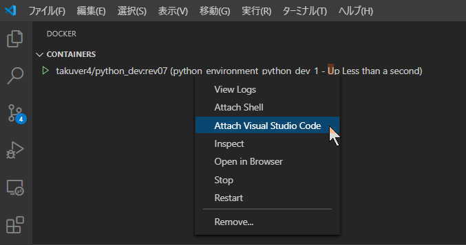

# Python Environment

## Overview

Build a python development environment.

## Requirements

* Docker for Windows
* Visual Studio Code
* X410 (X Window server for Windows 10)

## Build

```powershell
docker build -t takuver4/python_dev:rev08 .
```

## Push

```powershell
docker push takuver4/python_dev:rev08
```

```
docker run -it -P --name python_dev_08aa -v C:\Users\toruv\OneDrive\work\sample_code:/work/src --rm takuver4/python_dev:rev08 bash
```

## Create a container using `docker-compose up`

```powershell
docker-compose up -d
```

### (Option) Create a container using `docker run`

```powershell
$WORKING_DIR = "C:\Users\toruv\OneDrive\work\sample_code";
$DATA_DIR = "D:\abuse";
$PYTHON_LIB_DIR_ON_LINUX = "/usr/local/lib/python3.8/site-packages:/work/src/ty_lib";
docker run -it -d -P --name python_dev_07 `
-v ${WORKING_DIR}:/work/src -v ${DATA_DIR}:/work/overuse `
-e DISPLAY=docker.for.win.localhost:0.0 `
-e PYTHONPATH=$PYTHON_LIB_DIR_ON_LINUX --rm takuver4/python_dev:rev07
```

## Attach Visual Studio Code



## Information

### pip list

```txt
Package                       Version
----------------------------- ---------
alabaster                     0.7.12
attrs                         19.3.0
Babel                         2.8.0
backcall                      0.2.0
bleach                        3.1.5
certifi                       2020.6.20
chardet                       3.0.4
colour-science                0.3.15
cycler                        0.10.0
decorator                     4.4.2
defusedxml                    0.6.0
docutils                      0.16
entrypoints                   0.3
flake8                        3.8.3
idna                          2.10
imageio                       2.9.0
imagesize                     1.2.0
ipykernel                     5.3.2
ipython                       7.16.1
ipython-genutils              0.2.0
ipywidgets                    7.5.1
jedi                          0.17.1
Jinja2                        2.11.2
json5                         0.9.5
jsonschema                    3.2.0
jupyter                       1.0.0
jupyter-client                6.1.5
jupyter-console               6.1.0
jupyter-core                  4.6.3
jupyterlab                    2.1.5
jupyterlab-server             1.2.0
kiwisolver                    1.2.0
MarkupSafe                    1.1.1
matplotlib                    3.2.2
mccabe                        0.6.1
mistune                       0.8.4
more-itertools                8.4.0
mpmath                        1.1.0
nbconvert                     5.6.1
nbformat                      5.0.7
notebook                      6.0.3
numpy                         1.19.0
opencv-python                 4.3.0.36
packaging                     20.4
pandocfilters                 1.4.2
parso                         0.7.0
pexpect                       4.8.0
pickleshare                   0.7.5
Pillow                        7.2.0
pip                           20.1.1
pkg-resources                 0.0.0
pluggy                        0.13.1
prometheus-client             0.8.0
prompt-toolkit                3.0.5
ptyprocess                    0.6.0
py                            1.9.0
pycodestyle                   2.6.0
pyflakes                      2.2.0
Pygments                      2.6.1
pyparsing                     2.4.7
pyrsistent                    0.16.0
PySimpleGUI                   4.24.0
pytest                        5.4.3
python-dateutil               2.8.1
pytz                          2020.1
pyzmq                         19.0.1
qtconsole                     4.7.5
QtPy                          1.9.0
requests                      2.24.0
scipy                         1.5.1
Send2Trash                    1.5.0
setuptools                    44.0.0
six                           1.15.0
snowballstemmer               2.0.0
Sphinx                        3.1.2
sphinx-rtd-theme              0.5.0
sphinxcontrib-applehelp       1.0.2
sphinxcontrib-devhelp         1.0.2
sphinxcontrib-htmlhelp        1.0.3
sphinxcontrib-jsmath          1.0.1
sphinxcontrib-qthelp          1.0.3
sphinxcontrib-serializinghtml 1.1.4
sympy                         1.6.1
terminado                     0.8.3
testpath                      0.4.4
tornado                       6.0.4
traitlets                     4.3.3
urllib3                       1.25.9
wcwidth                       0.2.5
webencodings                  0.5.1
widgetsnbextension            3.5.1
```

### X Server

The [X410](https://x410.dev/) is recommended.

If you want to use the [VcXsrv](https://sourceforge.net/projects/vcxsrv/), please change the environment variable `DISPLAY`.

